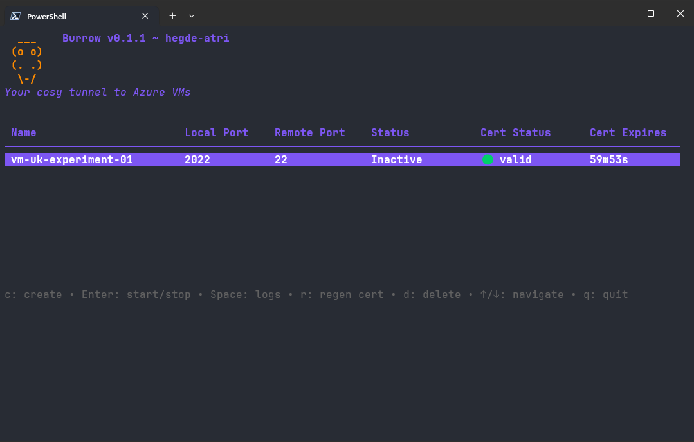
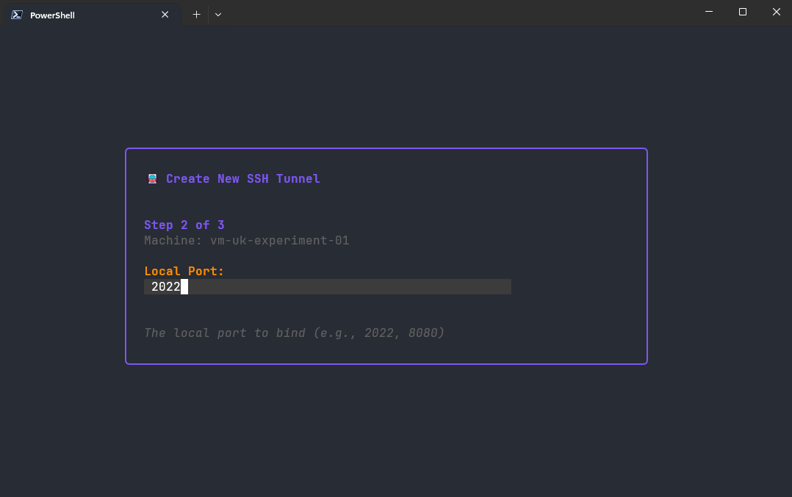

# az-burrow  

<p align="center">
A cosy terminal UI for managing Azure Bastion SSH tunnels to your VMs.
</p>

<p align="center">
  <a href="#features">Features</a> •
  <a href="#running">Running the Application</a> •
  <a href="#usage">Usage</a>
</p>

## Features




- Remember your VMs in a simple config file
- Create SSH tunnels through Azure Bastion with a few keystrokes
- Automatic SSH certificate validation and renewal
- Clean, minimal terminal interface that doesn't get in your way

**Star ⭐ this repository if you find it useful!**

## Running

> [!NOTE]
> You will need to the Azure CLI installed and be logged in to your account with a valid subscription selected. You will also need to have intialised the certificate using something like: `az ssh cert --file .ssh/az_ssh_config/azure-bastion-vm/id_rsa.pub-aadcert.pub --public-key-file .ssh/az_ssh_config/azure-bastion-vm/id_rsa.pub`

Download the latest [release](https://github.com/hegde-atri/az-burrow/releases/latest) and put it in a folder you want. Then from the folder you use `./az-burrow` (Windows: `.\az-burrow`).

If you are on nix and use the command, you can run it using the included `flake.nix`.

```bash
nix run "github:hegde-atri/az-burrow"
```

> Optionally you can add this to your path to use it from anywhere!

### Build from Source

```bash
git clone https://github.com/hegde-atri/az-burrow
cd az-burrow
# General build (current platform)
go build -o az-burrow ./cmd/az-burrow
# Linux x86
GOOS=linux GOARCH=amd64 go build -o bin/az-burrow ./cmd/az-burrow
# Windows x86
GOOS=windows GOARCH=amd64 go build -o bin/az-burrow.exe ./cmd/az-burrow
```

## Usage

Create a `burrow.config.yaml` file with your Azure VMs:

```yaml
machines:
  - name: my-vm
    resource_group: MY-RG
    target_resource_id: /subscriptions/.../virtualMachines/my-vm
    bastion_name: my-bastion
    bastion_resource_group: BASTION-RG
    # Optionally ssh config path
    ssh_config_path: ~/.ssh/az_ssh_config/azure-bastion-vm
```

Then just run:

```bash
./az-burrow
```

You can also specify a different config file:

```bash
./az-burrow /path/to/my-config.yaml
```

## Technology Stack

- **Go** - Because it's simple and compiles to a single binary
- **Bubble Tea** - For the terminal UI framework
- **Azure CLI** - For interacting with Azure Bastion

## Contributing

Contributions are welcome! Here's how you can help:

1. **Fork** the repository
2. **Create** a feature branch (`git checkout -b feature/amazing-feature`)
3. **Commit** your changes (`git commit -m 'Add some amazing feature'`)
4. **Push** to the branch (`git push origin feature/amazing-feature`)
5. **Open** a Pull Request

### Development Setup

Development is managed with `devenv` or just have Go v1.25 installed.

```bash
devenv shell
```

## Roadmap

- [x] Add VM machine config to config file
- [ ] Deactivate a tunnel without deleting it
- [x] Automatic certificate validation
- [ ] Preset tunnel configs from config file
- [ ] Automatic certificate initialisation

## Licence

This project is licensed under the AGPL License - see the [LICENCE](LICENCE) file for details.

## Support

If you run into issues or have questions, open an issue on [GitHub](https://github.com/hegde-atri/az-burrow/issues).
